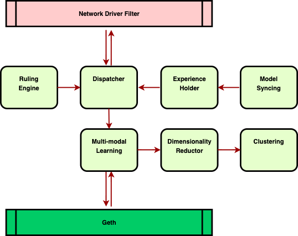

# ESP

To alleviate the pressure from attackers producing senseless transactions that merely consume the I/O of clients, we reckon it’s essential to build a multi-modal methodology to level the transactions, even the transaction senders.

Milestones:
| # | Item | Status |  
| :------ | :-------- | :------------------------: |
| 0 | Created the work plan | Finished |
| 1 | Collecting the sample tx data | Started |
| 2 | Exploring for the most suitable model | Waiting |
| 3 | Benchmarking & Optimizing | Waiting |
| 4 | Building the network driver filter | Waiting |
| 5 | Applying to production environments | Waiting |

## Introduction

This project aims to build a practical methodology for Ethereum client enforcement based on multi-modal transaction evaluation. The research outputs for this analysis will be a middleware layer with vectorized caches that can be built into the clients to classify the transactions and protect the Ethereum network.

### Architecture

### Motivation

Multi-modal learning analytics provides us with new toolkits and techniques to capture different data types from complicated learning activities in vibrant conditions.

We all know that since the emergence of business intelligence and machine learning, user data has grown to a substantial enough level in the internet industry. In the past decade, internet companies have paid enormous labor to develop and optimize the models to boost their business.
The turbulent era with higher tolerance to cyber attackers should pass, and the scale of data produced by the Ethereum network is booming after the consensus turned to PoS. Pumping transactions and state data forced the network to adopt higher gas prices to spare the clients from threats and attacks. However, rare researchers decided to use the analysis methodologies involved with modeling analysis.

Adding to that, we picked up a functional aspect from the related topics: using multi-modal learning to identify the risks brought by the transactions under the precise determination of their inner value.

### Why is multi-modal?

Within the experience of defending against cyber attacks, I acknowledged that the one RPC request could not be evaluated overall through the data body. To breach the limit put on the consequent research, more than two lines of more extensive time-frame analysis need to be added to the learning process. In essence, most multi-modal approaches are capable of providing clear and comprehensible ways of presenting information, making the researchers more unbiased.

The main reason for using multi-modal data sources is that they can extract complementary and richer information from multiple dimensions, providing much more optimistic results than a single one. Efficient modeling analysis of transactions at various levels of representation leads to faster classification and recognition of the tons of senseless RPC access produced daily. Performing mono-modal learning analysis can’t get the best understanding of remote calls’ context regarding the limited robustness and accuracy. In many cases like this, rational classification will be failed, restricted to the flaws in the universality of different feature levels and inaccuracies due to noise and missing concepts.

### Hypothesis

Let’s take all factors associated with one single Ethereum transaction that could be transformed into quantitative data features.
Here’re 3 key dimensions of the multi-modal data we consider practical to perform the analysis:

-   Transaction sender’s behavior data
-   Transaction data fields
-   Data access intention

We exacted a part of highly crucial features from behavior data and listed them here:

Table 1 Feature description transaction sender activity recognition:
| # | Variables |
| :------ | :-------- |
| 0 | Location |
| 1 | Client version |
| 2 | Client library |
| 3 | Frequency |
| 4 | Environment |
| 5 | Cross-domain method |
| 6 | Proxy |
| 7 | Retry strategy |
| 8 | User-agent |

The number of features impacting the multi-modal dataset should be topping 25. To simplify the model, we need to reduce overfilling by enhancing generalization. Notably, the cached clustering model is dynamic regarding the fact that Ethereum is a huge decentralized network, the cyber-attacks towards one single client probably iterate themselves. It can rip a large bulk of training time off, and the curse of dimensionality would be erased.

At some moment, the importance measure for features in cache might look like the below figure:

## Modeling Workflow

We use $X_{b} = \{ x_1^n, \dots ,x_T^n \}$ and $X_{d} = \{ x_1^m, \dots ,x_T^m \}$ to denote transaction sender’s behavior data and data fields in one transaction, $x_t^n$ and $x_t^m$ for the $n-$ and $m-$ dimensional feature vectors of the $X_{b}$ and $X_{d}$ modalities occurring at time $t$, respectively. Next, we combine the two modalities at time $t$ and consider the two unimodal output distributions at different levels of representations.

According to the technical specifications description in hypothesis section, then we need to train a multi-modal learning model $M$ that maps both $X_{b}$ and $X_{d}$ into the identical label set of $L = \{\zeta^{1}, \dots, \zeta^{T} \}$. Where conditions matches $x_b^T$ and $x_d^T$ are synchronized differently in time and space even if we could use Fourier transform to generalize them later. Here, we can construct two separate unimodal networks $N_{b}$ and $N_{d}$ from $X_{b}$ and $X_{d}$, $N_{b}:X_{b} \to Y, N_{d}:X_{d} \to Y$, and $M = N_{b}⨁N_{d}$. $Y$ denotes the predicted class label of the training samples generated by the output of the constructed networks, the multi-modal model $M$ can recognize the most discriminating patterns in the streaming data by learning a common representation that integrates relevant concepts from both modalities.

### Feature Selection

### Classification

### Model Performance Evaluation

## Conclusion

## Additional Information
